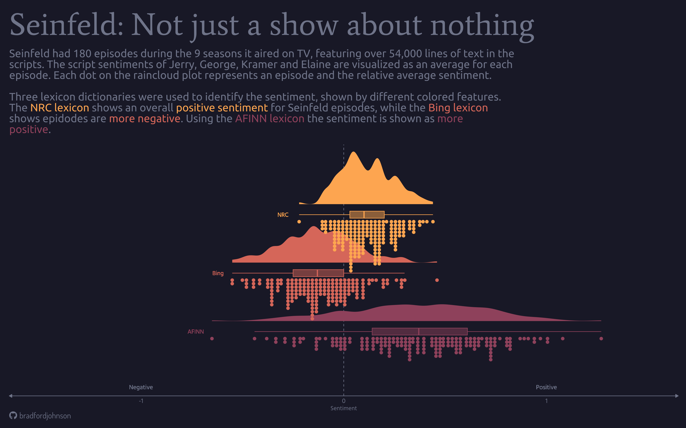

# Seinfeld text analysis using `R`

## Objectives
- **Sentiment analysis of Seinfeld scripts**
    - Positive and negative sentiments across different lexicons
- **Identify "catchpharses", common themes, and inside jokes**
    -  Word frequency and relationships
- **Word correlation**
    - How are certain words related?
- **Wrangle and visualize insightful relationships**...

## Methods
<!--- maybe break down by step and give brief summary, such as data wrangling with tidytext to seperate words grouped by "x" to investigate "y" --->
### The Data Workflow
- Seperate processes into dedicated `R` scripts and '*stages*':
    - Individual `R` file for each data prep / wrangling / cleaning task
    - Save wrangled and cleaned data frames as `.csv`'s
    - Load prepared data into dedicated visualization scripts
    - Save individual visuals and final visuals

**This workflow is done in stages for the following reasons:**
- Lighten the workload on a machine - *lots of text in these datasets*
- Maintain an organized work enviroment
- Prepared data can be saved and used in the future - *version control*
- Errors can be isolated
### Sentiment Analysis
1. `unnest_tokens()` - *Seperate text into rows of single words*
2. `anti_join()` - *Drop uninteresting words (stop words)*
3.  `get_sentiment()` - *Evaluating 3 different lexicons:*
    - Bing
    - NRC
    - AFINN
### Bigrams
> **Bigrams:** Pairs of consecutive words grouped by character with counts
1. `unnest_tokens(bigram)` - *Seperate text into rows of two words*
2. `filter()` - *Remove common stop words and selected words*
3. `count()` - *Get counts of bigrams*

## Visuals
### Sentiment Raincloud

    
 

 
## Citations
- [Seinfeld data](https://www.kaggle.com/datasets/thec03u5/seinfeld-chronicles)
- Minqing Hu and Bing Liu, “Mining and summarizing customer reviews.”, Proceedings of the ACM SIGKDD International Conference on Knowledge Discovery & Data Mining (KDD-2004), 2004.
- Mohammad, S.M. and Turney, P.D. (2013), CROWDSOURCING A WORD–EMOTION ASSOCIATION LEXICON. Computational Intelligence, 29: 436-465. [https://doi.org/10.1111/j.1467-8640.2012.00460.x](https://doi.org/10.1111/j.1467-8640.2012.00460.x)
