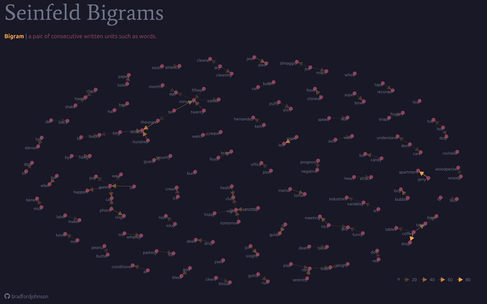

# Seinfeld Text Analysis using `R`

## Objectives

-   **Sentiment analysis of Seinfeld scripts**
    -   Positive and negative sentiments across different lexicons
-   **Identify "catchphrases", common themes, and inside jokes**
    -   Word frequency and relationships
-   **Word correlation**
    -   How are certain words related?
-   **Wrangle and visualize insightful relationships**...

## Methods

### The Data Workflow

-   Separate processes into dedicated `R` scripts and '*stages*':
    -   Individual `R` file for each data prep / wrangling / cleaning task
    -   Save wrangled and cleaned data frames as `.csv`'s
    -   Load prepared data into dedicated visualization scripts
    -   Save individual visuals and final visuals

**This workflow is done in stages for the following reasons:**

-   Lighten the workload on a machine \| *lots of text in these data sets*

-   Maintain an organized work environment

-   Prepared data can be saved and used in the future \| *version control*

-   Errors can be isolated

### Sentiment Analysis

-   `unnest_tokens()` \| Separate *text into rows of single words*

-   `anti_join()` \| *Drop uninteresting words (stop words)*

-   `get_sentiment()` \| *Evaluating 3 different lexicons:*

    -   Bing

    -   NRC

    -   AFINN

### Bigrams

> **Bigrams:** Pairs of consecutive words grouped by character with counts

-   `unnest_tokens(bigram)` \| Separate *text into rows of two words*
-   `filter()` \| *Remove common stop words and selected words*
-   `count()` \| *Get counts of bigrams*

## Visuals

### Sentiment Raincloud

------------------------------------------------------------------------

### Bigrams

## What I Learned

-   How to use lexicons and "tune" them for a specific need

-   How to filter words like stop words, and customize the lists of words

-   Using `bigrams`, `trigrams`, and `correlation` to identify common themes and trends

-   How to implement these methods to paint the bigger picture

## Citations

### Data

-   [Seinfeld data](https://www.kaggle.com/datasets/thec03u5/seinfeld-chronicles)

### Lexicons

-   Finn Årup Nielsen A new ANEW: Evaluation of a word list for sentiment analysis in microblogs. Proceedings of the ESWC2011 Workshop on 'Making Sense of Microposts': Big things come in small packages 718 in CEUR Workshop Proceedings 93-98. 2011 May. <https://arxiv.org/abs/1103.2903>.

-   Minqing Hu and Bing Liu, "Mining and summarizing customer reviews.", Proceedings of the ACM SIGKDD International Conference on Knowledge Discovery & Data Mining (KDD-2004), 2004.

-   Mohammad, S.M. and Turney, P.D. (2013), CROWDSOURCING A WORD--EMOTION ASSOCIATION LEXICON. Computational Intelligence, 29: 436-465. <https://doi.org/10.1111/j.1467-8640.2012.00460.x>
